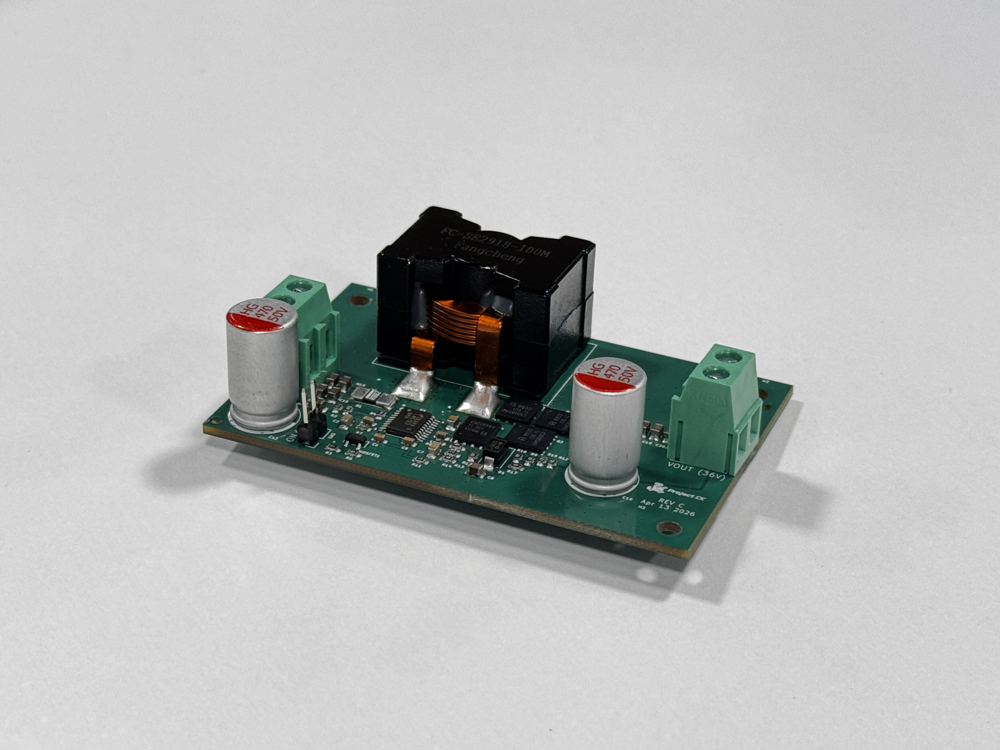

# Boost Converter (LM5122-Q1) — Rev C

**Owner / Contact:** Tim Wang — timwang007@outlook.com  
**Revision:** Rev C  
**Date:** 2026-04-13  
**Project:** Project CK  

## Photo

## 1) Scope
Rev C is the next active boost-converter spin for the LM5122-Q1 power stage. It carries forward the Rev B architecture and prior value/layout updates, then adds more MOSFET capacity on both switching sides plus per-gate damping so the board can handle higher current with better current sharing and switching control.

## 2) PCB stack-up (applies to all Rev C boards)
- Layer stack:
  - F.Silkscreen (top silk screen), color/material not specified
  - F.Paste (top solder paste)
  - F.Mask (top solder mask), thickness 0.01 mm, color not specified, material not specified, Er 3.3, LossTg 0
  - F.Cu 0.035 mm
  - Dielectric 1 (prepreg) 0.10 mm FR4, Er 4.5, LossTg 0.02
  - In1.Cu 0.017 mm
  - Dielectric 2 (core) 1.25 mm FR4, Er 4.5, LossTg 0.02
  - In2.Cu 0.017 mm
  - Dielectric 3 (prepreg) 0.10 mm FR4, Er 4.5, LossTg 0.02
  - B.Cu 0.035 mm
  - B.Mask (bottom solder mask) 0.035 mm, color not specified, material not specified, Er 3.3, LossTg 0
  - B.Paste (bottom solder paste)
  - B.Silkscreen (bottom silk screen), color/material not specified
  - Finish: HAL lead-free

## 3) Change Summary
### Carryover from Rev B
- Rev B LM5122-Q1 architecture, value corrections, and prior EMI/layout cleanup are carried forward unless superseded here.
- Rev B soft-start shutdown control through the `SS` pin remains in place.
- Rev B mechanical/layout additions such as mounting holes, external-signal GND reference, Kelvin sense routing, and return-via cleanup remain part of the design baseline.

### Power stage updates
- Added one extra MOSFET in parallel on the high-side path to increase current capability and reduce per-device stress.
- Added one extra MOSFET in parallel on the low-side path to increase current capability and improve current sharing in the synchronous path.
- Added `2 Ohm` gate resistors for each MOSFET gate to damp ringing and improve switching control with the expanded MOSFET bank.

### Bring-up / validation focus
- Re-check gate-drive timing, switching-node ringing, and dead-time behavior with the added parallel MOSFETs before releasing fabrication data.
- Re-verify thermal rise and current sharing across the high-side and low-side MOSFET groups at the intended higher load current.

## 4) Reference Notes
- Use `hardware/archive/boost_manufacturing_rev_b/README.md` for the Rev B baseline and prior component/layout changes.
- Use `hardware/archive/boost_manufacturing_rev_a/README.md` for the original architecture, operating targets, and bring-up context.

## 5) Files
- `Boost converter_3D.step` — 3D STEP model of the assembled PCB.
- Rev C BOM/CPL/Gerbers have not been regenerated yet. Regenerate all manufacturing outputs after the Rev C KiCad design is finalized.
- This folder currently holds the Rev C documentation entry so the active hardware naming and README format stay aligned with the rest of `hardware/final/`.
